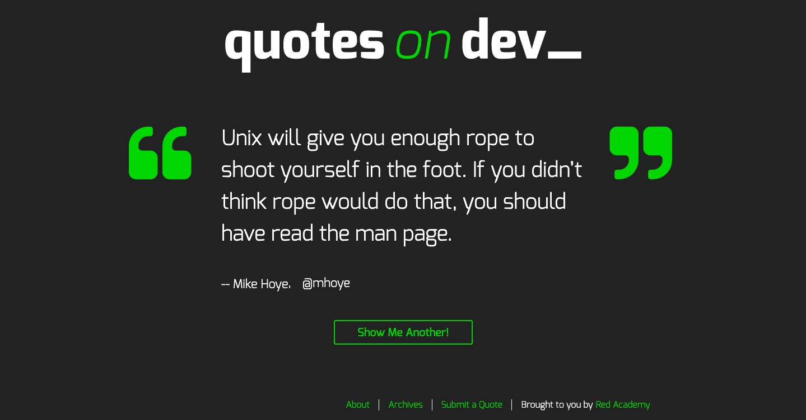
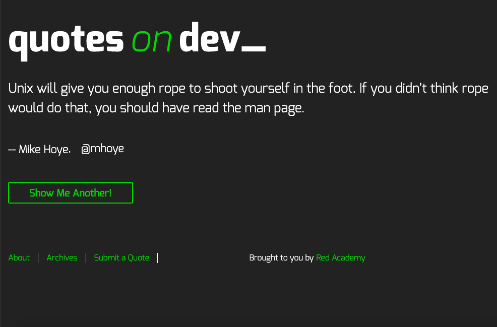
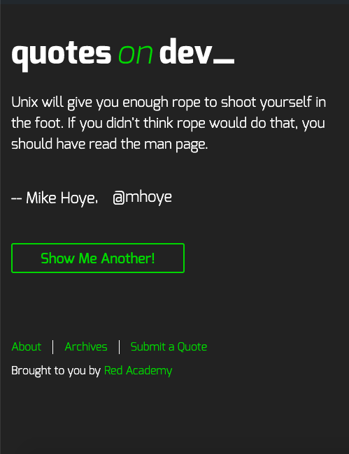

# Quotes on Dev

A simple site that cycles through an archive of quotes from developers on button click, powered by wordpress and is made in mobile, tablet, and desktop versions.

## Installation

1. Clone this project and add to your htdocs in MAMP.

2. In command line, cd to the quotes on dev theme.

3. Run gulp.

# Technologies

* HTML/php

* CSS/sass

* JS/JQuery

* Gulp, Ajax, API

* Wordpress Suite

# Personal Learnings

* Learned how to use ajax get and post requests to populate site with posts and also add posts.

* Increased understanding of how to use and reuse php templates and functions.

* Increased understanding of wordpress's html structure to better manipulate css styling.

# Screenshots

## Desktop

## Tablet

## Mobile 

